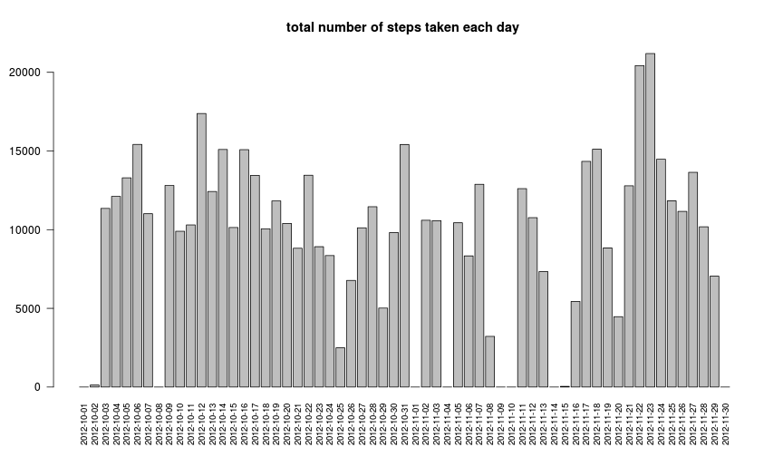
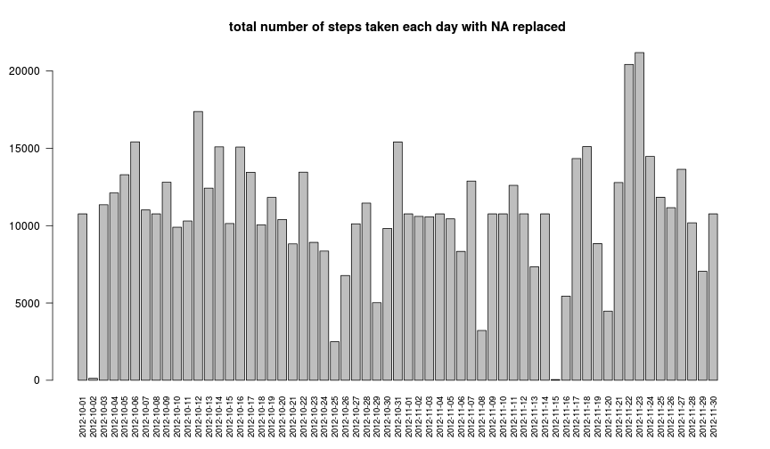

####Global options:

```r
# set global options
knitr::opts_chunk$set(echo=TRUE)
knitr::opts_chunk$set(comment=NA)
library("lattice")
cache=TRUE
```
#Reproducible Research

##Peer Assessment 1

###Introduction

It is now possible to collect a large amount of data about personal movement using activity monitoring devices such as a [Fitbit](http://www.fitbit.com/), [Nike Fuelband](http://www.nike.com/us/en_us/c/nikeplus-fuelband), or [Jawbone Up](https://jawbone.com/up). These type of devices are part of the "quantified self" movement  - a group of enthusiasts who take measurements about themselves regularly to improve their health, to find patterns in their behavior, or because they are tech geeks. But these data remain under-utilized both because the raw data are hard to obtain and there is a lack of statistical methods and software for processing and interpreting the data.

This assignment makes use of data from a personal activity monitoring device. This device collects data at 5 minute intervals through out the day. The data consists of two months of data from an anonymous individual collected during the months of October and November, 2012 and include the number of steps taken in 5 minute intervals each day.

### Loading and preprocessing the data

####Data

**Dataset:** [Activity monitoring data](https://d396qusza40orc.cloudfront.net/repdata%2Fdata%2Factivity.zip)
    
The variables included in this dataset are:

- steps: Number of steps taking in a 5-minute interval (missing values are coded as NA)

- date: The date on which the measurement was taken in YYYY-MM-DD format

- interval: Identifier for the 5-minute interval in which measurement was taken


```r
dat = read.csv("activity.csv")
```


```r
head(dat,3)
```

```
  steps       date interval
1    NA 2012-10-01        0
2    NA 2012-10-01        5
3    NA 2012-10-01       10
```

```r
str(dat)
```

```
'data.frame':	17568 obs. of  3 variables:
 $ steps   : int  NA NA NA NA NA NA NA NA NA NA ...
 $ date    : Factor w/ 61 levels "2012-10-01","2012-10-02",..: 1 1 1 1 1 1 1 1 1 1 ...
 $ interval: int  0 5 10 15 20 25 30 35 40 45 ...
```


### What is mean total number of steps taken per day?


```r
steps_day <- tapply(dat$steps, dat$date, sum, na.rm=T )
barplot(steps_day,las=2, cex.names =  0.8, main = "total number of steps taken each day ")
```

 

```r
#days <- names(steps_day)
#stripplot(days~steps_day, type="h",xlab = "steps", ylab = "day")
```
####Mean:

```r
mean(steps_day)
```

```
[1] 9354
```
####Median:

```r
median(steps_day)
```

```
[1] 10395
```


### What is the average daily activity pattern?


```r
daily <- tapply(dat$steps, dat$interval, mean, na.rm=T )
plot(names(daily), daily, type="l", ylab = "average number of steps", xlab = "interval", main = "Average daily activity pattern")
```

 

####Which 5-minute interval, on average across all the days in the dataset, contains the maximum number of steps?


```r
which.max(daily)
```

```
835 
104 
```

```r
max(daily)
```

```
[1] 206.2
```
Note: This means interval 835 in the position 104, with a value of 206.1698

### Imputing missing values

####Total number of missing values in the dataset:

```r
sum(is.na(dat))
```

```
[1] 2304
```

```r
#the NA are only in the first column
```

####Replace the missing values with the mean for that 5-minute interval:

```r
datna <- dat
for (i in 1:length(datna[,1])){
  if(is.na(datna[i,1])){
    datna[i,1] <- round(daily[[as.character(datna[i,3])]]) 
  }
}
```

####Total number of steps taken each day:

```r
steps_day_na <- tapply(datna$steps, datna$date, sum)
barplot(steps_day_na,las=2, cex.names =  0.8, main = "total number of steps taken each day with NA replaced")
```

 

####Mean:

```r
mean(steps_day_na)
```

```
[1] 10766
```
####Median:

```r
median(steps_day_na)
```

```
[1] 10762
```

####This values are higher *(0.15 for the mean, and 0.04 for the median)* from those before replacing the NA.

### Are there differences in activity patterns between weekdays and weekends?


```r
day <- as.factor(ifelse((as.POSIXlt(datna[,2])$wday)==0|(as.POSIXlt(datna[,2])$wday)==6,"weekend","weekday"))
datna <- cbind (datna, day)
```


